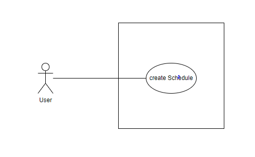
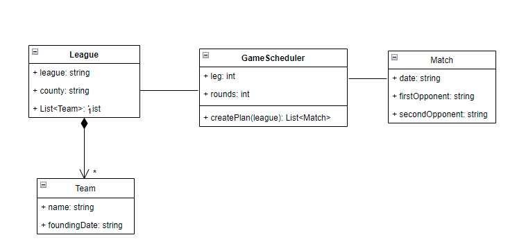
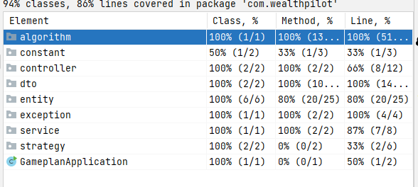
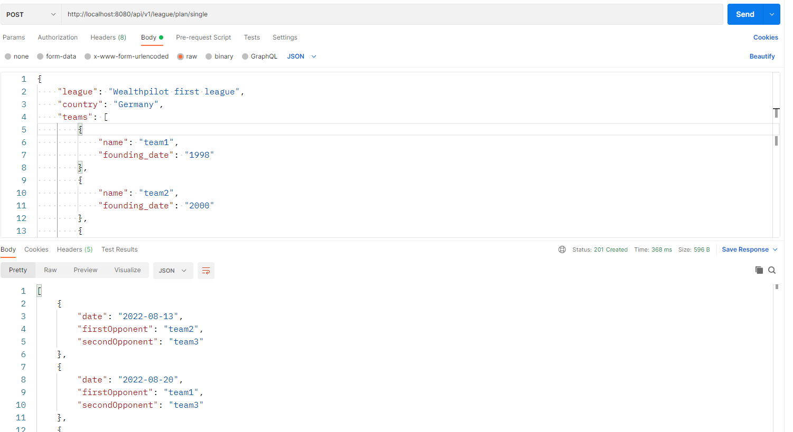
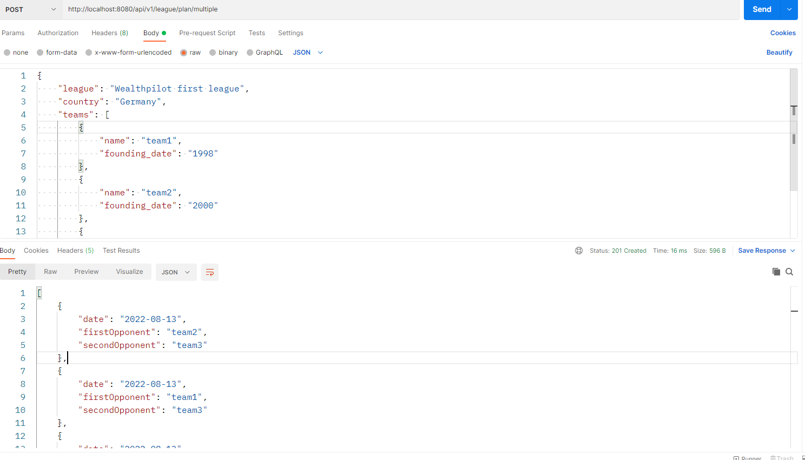

# Wealthpilot first league 

## Requirements 
1. A Tournament/league contains many teams
2. there are K number of legs in a schedule
3. in each leg,  all team play each other
4. Match should always take place on Saturday.
5. Every Saturday there will be exactly one game at 5 pm
6. Only after all teams have successfully completed the first leg, the second leg will start.
7. There will be a 3-week break between the first and second leg.  the same pairings as in the first round follow in the same order; however, the two teams are swapped in each case.

Extended requirement
1. every Saturday there are as many matches as possible instead of one.

## Usecase diagram 
Requirement is very simple. User need to create schedule / game plan for given team  

## class diagram 

## Assumption 
1. security is out-of-scope
2. No requirement for database connection, as use case create a game plan 
3. Docker containarization will add on demand 

## Implementation consideration 
1. **Round-robin scheduling** method used in this code, as all team need to play each other once 

## Tools 
1. Spring boot 
2. Java 11 
3. lombok 
4. JUnit 

### Test coverage report 

### API 
1. Schedule single matches very Saturday with 3 week gap between each leg 
   - End point : http://localhost:8080/api/v1/league/plan/single
   - Type : POST 
   - Screenshot 
   
2. Schedule maximum matches very Saturday  with 3 week gap between each leg
   - End point : http://localhost:8080/api/v1/league/plan/multiple
   - Type : POST
   - Screenshot 
   